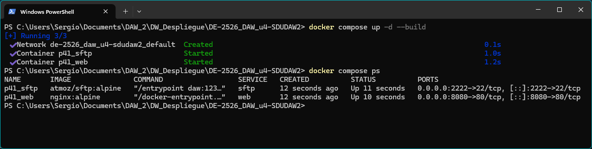
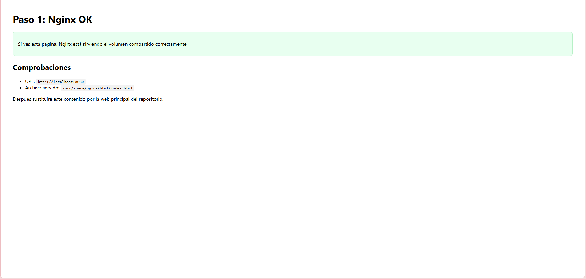
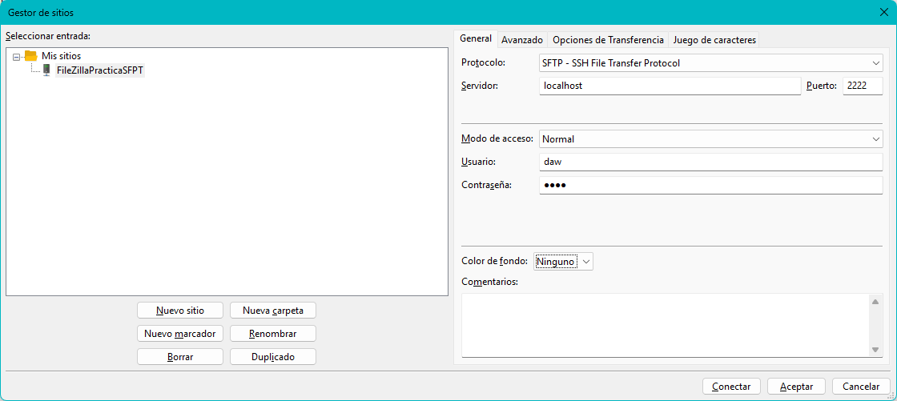
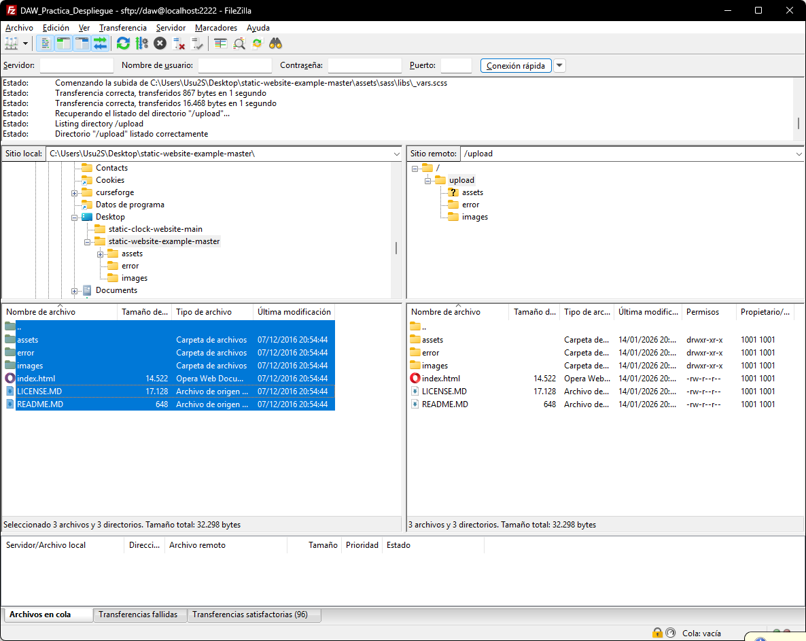
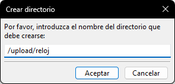
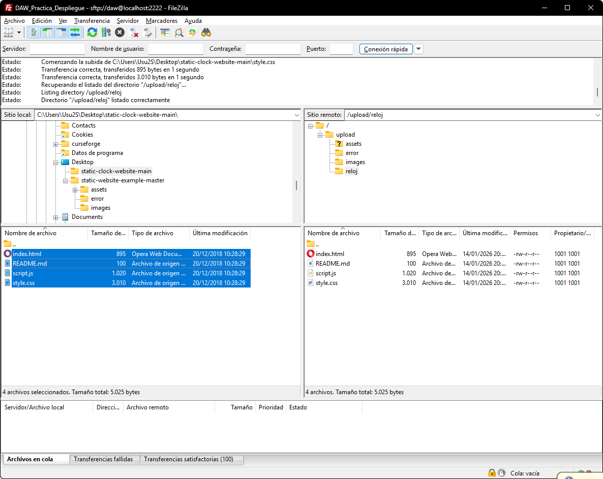
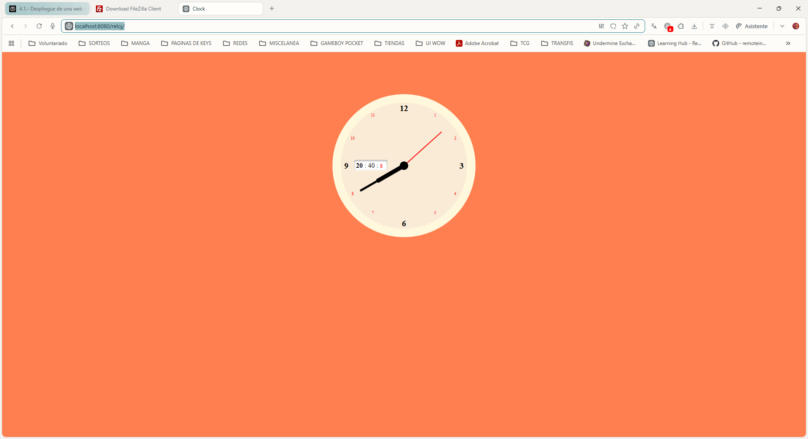

# PASO 1: INFRAESTRUCTURA DOCKER (NGINX + SFTP)

## OBJETIVO DEL PASO
Montar una infraestructura `inmutable` con Docker Compose que replique el escenario del enunciado: un servicio web (Nginx) y un servicio de transferencia (SFTP) donde lo que se suba por SFTP sea visible inmediatamente desde el navegador, sin reiniciar nada.

### POR QUE SE HACE ASI (DECISIONES TECNICAS)
- Dos contenedores separados: se usa un contenedor para Nginx (servir la web) y otro para SFTP (subida de ficheros), porque el ejercicio pide un `Servicio Web (Nginx)` y un `Servicio de Transferencia (SFTP)`.
- Puertos mapeados 80->8080 y 22->2222: el enunciado exige que el puerto 80 del contenedor Nginx se mapee al 8080 del host, y el puerto 22 del contenedor SFTP se mapee al 2222 del host.
- Volumen compartido (la clave del ejercicio): ambos contenedores comparten un volumen/carpeta para que Nginx sirva el mismo contenido que el usuario sube por SFTP, cumpliendo que lo subido por FileZilla sea visible inmediatamente en el navegador.
- Rutas internas: Nginx suele servir desde `/usr/share/nginx/html` y el ejercicio indica que hay que `conectar` las rutas internas de ambos contenedores usando el mismo volumen.

### ARCHIVOS IMPLICADOS
- docker-compose.yml: define los 2 servicios, sus puertos, y el volumen compartido.
- default.conf (opcional en este paso, recomendado): fuerza que Nginx use como root el directorio del volumen compartido, alineado con el enfoque de inyectar configuracion en Docker (mas importante en el paso de HTTPS, pero util desde el principio).

### EVIDENCIAS (CAPTURAS) PARA ESTE PASO
Estas capturas encajan con la checklist de evidencias (especialmente para demostrar contenedores activos y mapeo de puertos).

- 
- 

Código usado:

``docker-compose.yml``

```bash
services:
  web:
    image: nginx:alpine
    container_name: p41_web
    ports:
      - "8080:80"
    volumes:
      - ./www:/usr/share/nginx/html:ro
      - ./default.conf:/etc/nginx/conf.d/default.conf:ro
    depends_on:
      - sftp

  sftp:
    image: atmoz/sftp:alpine
    container_name: p41_sftp
    ports:
      - "2222:22"
    # usuario:pass:uid:gid:directorio
    command: "daw:1234:1001:1001:upload"
    volumes:
      # El contenedor SFTP escribe en /home/daw/upload
      - ./www:/home/daw/upload
```

``default.conf``

```bash
server {
  listen 80;
  server_name localhost;

  root /usr/share/nginx/html;
  index index.html;

  location / {
    try_files $uri $uri/ =404;
  }
}
```

# PASO 2: TRANSFERENCIA SFTP (FILEZILLA) Y DESPLIEGUE DE CONTENIDO

## OBJETIVO DEL PASO
En este paso se realiza el despliegue de los ficheros de la web usando SFTP con FileZilla, conectando contra el contenedor SFTP expuesto en el puerto 2222. El objetivo es demostrar que los ficheros subidos por SFTP aparecen inmediatamente servidos por Nginx en el puerto 8080 gracias al volumen compartido entre ambos contenedores

## POR QUE SE HACE ASI (DECISIONES TÉCNICAS)
- Se usa SFTP (y no FTP) porque SFTP es el protocolo de transferencia seguro sobre SSH, y el enunciado lo recomienda frente a FTP por seguridad.
- Se usa un cliente gráfico (FileZilla) porque el enunciado permite clientes como FileZilla (que ha costado descargarlo porque la página mandaba a descargar versiones promo que Windows decia que eran virus) o WinSCP para realizar la transferencia.
- Se suben los ficheros al directorio ``upload`` del usuario SFTP, ya que en el contenedor ``atmoz/sftp`` el usuario queda chroot en su home y el directorio de escritura habitual es un subdirectorio (mi caso ``upload``).
- Gracias al volumen compartido, lo que se escribe en /home/daw/upload dentro del contenedor SFTP se refleja en la carpeta ./www del host, que es la misma que Nginx sirve desde /usr/share/nginx/html.

## CONFIGURACIÓN EN FILEZILLA
En el *Gestor de sitios* en Filezilla se crea una entrada con:
- Protocolo: ``SFTP - SSH File Transfer Protocol``
- Servidor: ``localhost`` por ser mi caso.
- Puerto: ``2222`` configurado por mi caso.
- Modo de acceso: ``Normal``.
- Usuario: ``daw`` configurado para mi caso.
- Contrseña: ``1234``.



## DESPLIEGUE DE LAS DOS WEBS (SEGUN LA PRÁCTICA)
La práctica exige desplegar dos aplicaciones web estáticas:

1. Web principal (en carpeta raiz):
- Repositorio desde el que se saca: ``https://github.com/cloudacademy/static-website-example``
- Ubicación en el servidor: raiz del sitio.
- En FileZilla: subir el contenido del repositorio a ``/upload`` (no subir la carpeta contenedora, sino lo que hay dentro y dejar en la raiz en index.html)
- Comprobación de los pasos dados:

Carpeta con el contenido, se debe hacer click derecho sobre el contenido en el hueco de abajo a la izquierda, señalando todos los archivos, y pulsar en subir:



Una vez subido, se verá como queda en el hueco de abajo a la derecha. Luego abriendo ``localhost:8080``:


2. Web secundaria (subcarpeta /reloj):
- Repositorio del que se saca: 'https://github.com/ArchiDep/static-clock-website'
- Ubicación en el servidor: ``/reloj``
- En FileZilla: se crea primero la carpeta en la raiz llamada ``/reloj`` y se sube dentro el contenido del repositorio del reloj (deja su ``index.html`` en la raiz de ``/reloj`` lo cual crea esa ruta).
- Comprobación de los pasos dados:



Una vez creada, clicamos en ella para que sea la nueva carpeta donde se suben cosas. Mismo sistema de la página 1, localizar la carpeta, ver sus archivos, seleccionar, clic derecho, subir.



Luego entramos en el navegador a la ruta: ``localhost:8080/reloj`` y vemos:



Que funciona perfectamente.